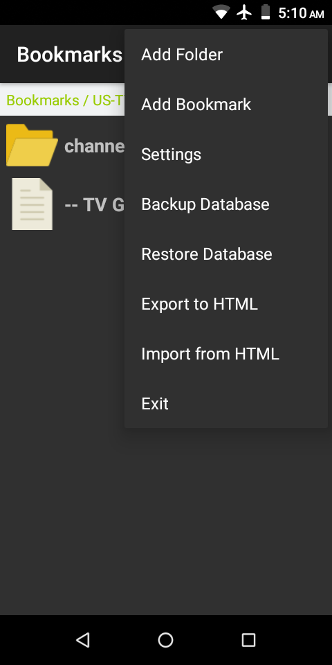
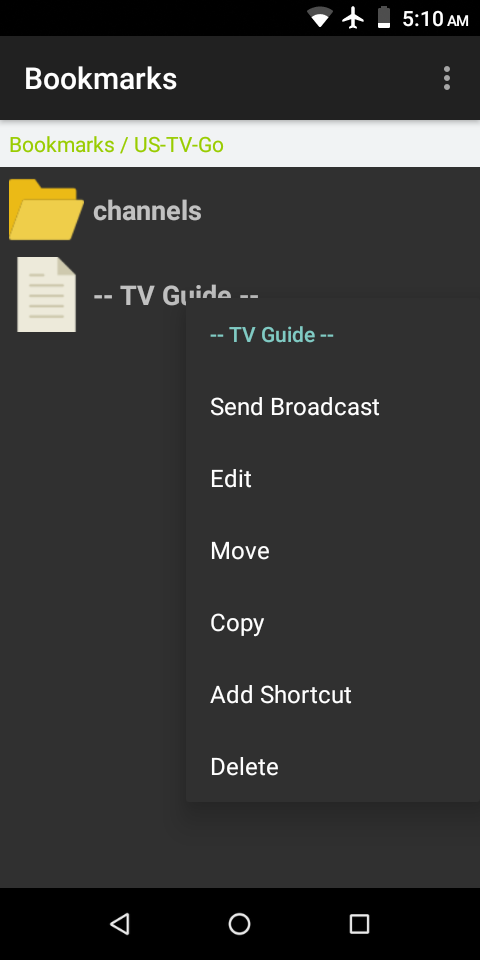
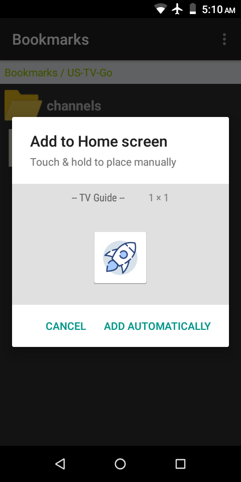
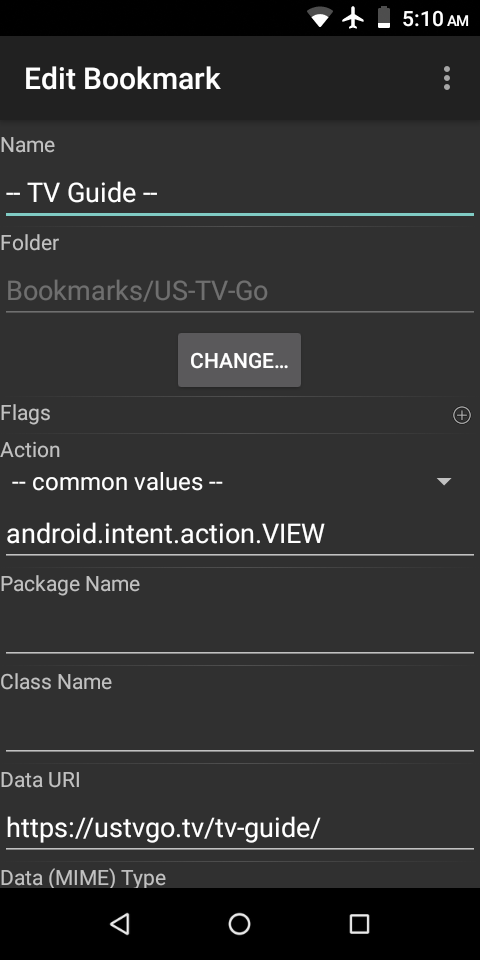
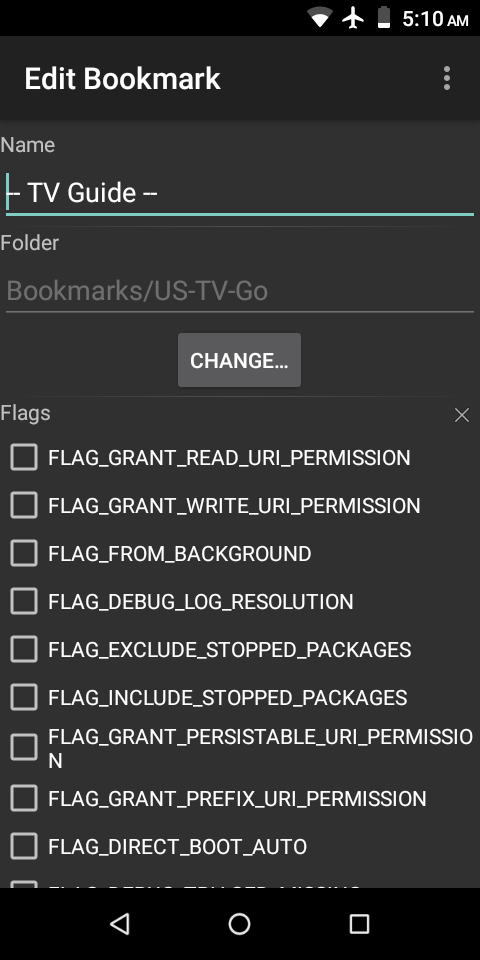
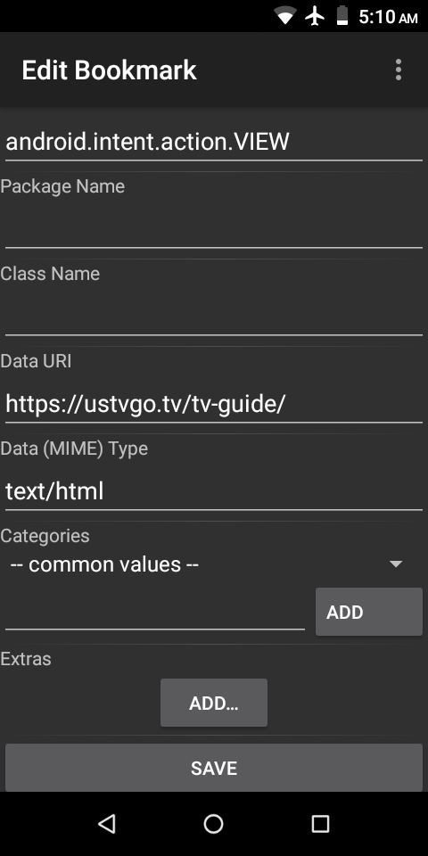
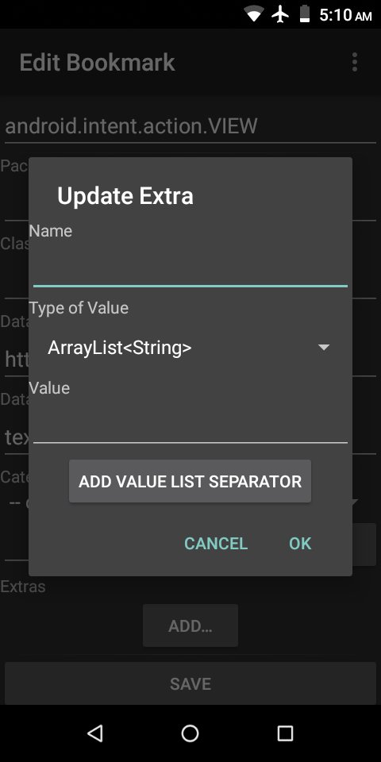
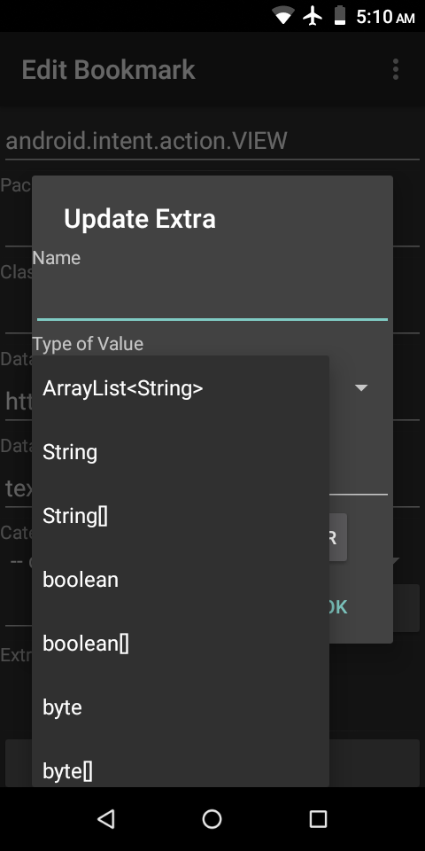

### [Bookmarks](https://github.com/warren-bank/Android-Bookmarks)

Android app to save Intents as an organized collection of bookmarks.

#### Summary

* an Intent in Android can be used to open any Activity in any installed application, and pass to it any type or quantity of data
* in this sense, an Intent is like a bookmark for Android
  - a bookmark in a web browser can be used to open the URL for a webpage
  - an Intent in Android can be used to open anything
    * including the URL for a webpage&hellip; in any available web browser application

#### Required Reading

* documentation for Intents:
  - [overview](https://developer.android.com/training/basics/intents)
  - [Java class reference](https://developer.android.com/reference/android/content/Intent)

#### Features

* Intents can be configured:
  - manually
  - by intercepting the Intents started by other applications
  - by [importing bookmarks](https://web.archive.org/web/20130620163622/https://support.mozilla.org/en-US/kb/import-bookmarks-html) that were exported from a web browser in the [Netscape Bookmark file format](https://web.archive.org/web/20130513213743/http://msdn.microsoft.com/en-us/library/aa753582(VS.85).aspx)
    * creates a folder hierarchy within the currently selected folder
    * creates Intents that will open the URL for a webpage in any available web browser application
* Intents are organized hierarchically into folders
* Intents and folders can both be edited
  - Intent name
  - Intent location within folder hierarchy
  - Intent configuration
  - folder name
  - folder location within folder hierarchy
* Intents can be copied
  - duplicate Intent can then be edited
* Intents can perform any of the following operations:
  - Send Broadcast
  - Start Activity
  - Start Foreground Service
    * only available on Android 8.0 and higher
  - Start Service
  - Stop Service
* Intents can be assigned to "Home screen" widgets
  - one Intent per widget
  - each widget provides the ability to start an Activity with the chosen Intent from the "Home screen" without the need to open the _Bookmarks_ application and navigate through the folder hierarchy
* the database can be backed up to a single file, and subsequently restored
  - enables copying all Intents and folders to another Android device

#### Additional Features

* long-press on an Intent or folder to display a context menu
  - menu options common to both:
    * _Move_
      - click this menu option to select the contextual item for the purpose of changing its location within the folder hierarchy
        * multiple items can be selected concurrently
        * when one or more items are selected, the top ActionBar menu adds two additional options:
          1. Move to Current Folder
             - updates the location within the folder hierarchy of all Intents and folders selected for _Move_ to the folder with its contents currently displayed
          2. Cancel Move
             - empties the list of selected items
    * _Delete_
  - menu options only for Intents:
    * _Edit_
    * _Copy_
    * _Add Shortcut_
      - adds a "Home screen" widget
  - menu options only for folders:
    * _Hide_ / _Unhide_ toggle
      - updates the _hidden_ state of the contextual folder
      * an option in _Settings_ determines whether to hide or show _hidden_ folders
      * this option must allow _hidden_ folders to be shown in order to be able to long-press on a _hidden_ folder&hellip; to toggle its _hidden_ state to __off__
    * _Rename_
* the database can be exported to a single HTML file in the Netscape Bookmark file format&hellip; with some caveats:
  - the folder hierarchy is exported
    * the export dialog gives the options:
      - to export the entire database (default), or only the current folder and its descendants
      - to exclude _hidden_ folders
  - Intents are exported with limitations:
    * _name_ and _data URI_ attributes are used to generate an HTML anchor element
    * no other attributes are included in the HTML representation of an Intent

#### Notes

* minimum supported version of Android:
  * Android 1.0 (API 1)

#### Additional Notes

* to export bookmarks in the Netscape Bookmark file format in Chrome (desktop, version 100):
  * type into the location bar: `chrome://bookmarks/`
    - or: open menu  &gt; Bookmarks &gt; Bookmark manager
  * to the right of the search bar:
    - open menu  &gt; Export bookmarks

#### Screenshots

#### Legal

* copyright: [Warren Bank](https://github.com/warren-bank)
* license: [GPL-2.0](https://www.gnu.org/licenses/old-licenses/gpl-2.0.txt)
